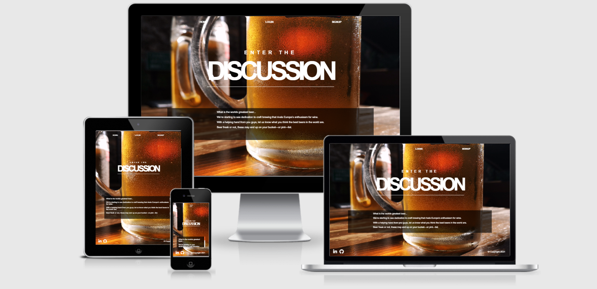

[View the beer forum here](http://noirlex1.pythonanywhere.com/)

# Full stack website using html5 scss vanilla js and flask

---

Users can sign up, login, logout, discuss their favourite beers, comment on discussions, like them, delete them as well as their own comments. They have access to their details they signed up with which can also be updated as well as having access to their own discussions/seeing others discussions

When I have time in the future, I want to change this to vue front end and expand the core website concept for a forum/discussion (possibly extend to part e-commerce) of multiple variables related to beer. Expand on scss/css3 concepts more eg variables, functions etc and use of more
